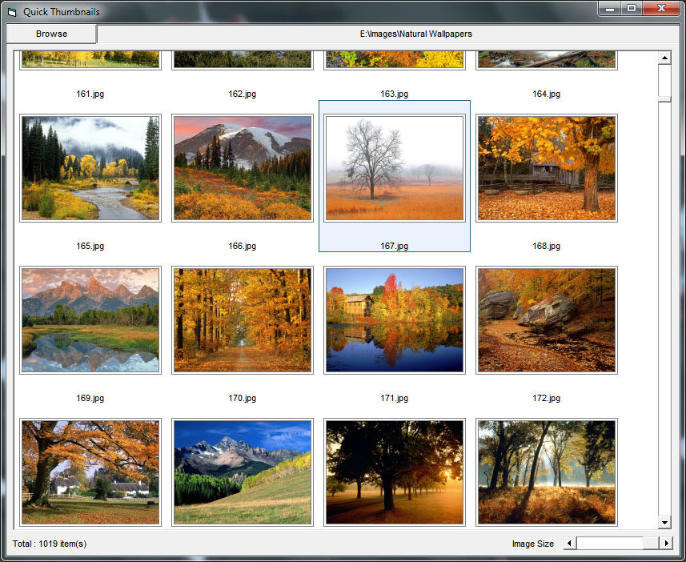



## Quickly Thumbnails Generator \- Resize while loading or complete \- Must see :\)

### Description

Demo generate image thumbnails. Improve loading speed & smoothing scroll. GDI Resize. You can resize, select, scroll while program loading image :). Average speed : 100 pics (1920x1200px)/3.7second with thumbnail size 170px. Hope you like it :)

 
### More Info
 

             |
---                |---
**Submitted On**   |2010-11-16 11:31:22
**By**             |[siguri92](https://github.com/Planet-Source-Code/PSCIndex/blob/master/ByAuthor/siguri92.md)
**Level**          |Intermediate
**User Rating**    |4.9 (54 globes from 11 users)
**Compatibility**  |VB 6\.0
**Category**       |[Graphics](https://github.com/Planet-Source-Code/PSCIndex/blob/master/ByCategory/graphics__1-46.md)
**World**          |[Visual Basic](https://github.com/Planet-Source-Code/PSCIndex/blob/master/ByWorld/visual-basic.md)
**Archive File**   |[Quickly\_Th21929711162010\.zip](https://github.com/Planet-Source-Code/siguri92-quickly-thumbnails-generator-resize-while-loading-or-complete-must-see__1-73593/archive/master.zip)

